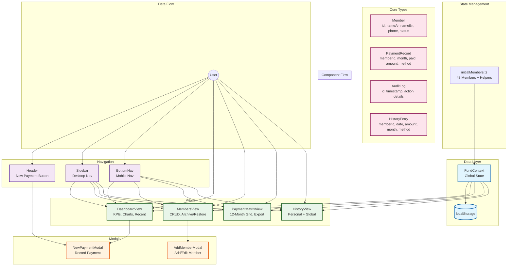

# FamilyFund Architecture Diagram

## Component Relationships

### State Management (FundContext)
- **members[]**: 48 family members with Arabic/English names, phone, join date, status
- **payments[]**: Payment records per member per month (amount, method, date)
- **auditLogs[]**: Action audit trail for all mutations
- **personalHistory[]**: Individual payment history per member

### Data Persistence
- All data stored in localStorage with keys:
  - `familyFund_members`
  - `familyFund_payments`
  - `familyFund_auditLogs`
  - `familyFund_personalHistory`

### View Components
1. **DashboardView**: KPIs (total members, active, total amount), bar chart (6 months), recent transactions
2. **MembersView**: Member list with search, archive/restore, add/edit modal
3. **PaymentMatrixView**: 12-month grid, toggle paid/unpaid, search, CSV export
4. **HistoryView**: Personal history (per member) + global history (all members)

### Navigation Flow
- **Header**: Fixed top bar with "New Payment" button
- **Sidebar**: Desktop navigation (left side, RTL-aware)
- **BottomNav**: Mobile navigation (bottom bar)

### Modal Interactions
- **AddMemberModal**: Used by MembersView for add/edit operations
- **NewPaymentModal**: Used by Header and DashboardView for recording payments

### Helper Functions (initialMembers.ts)
- `getMonthlyPaymentStatus()`: Computes payment status for a member in a given month
- `getPaymentStatusForMonth()`: Returns payment status for display
- `formatCurrency()`: Formats amount as SAR currency
- `generateId()`: Generates unique IDs for members and payments
