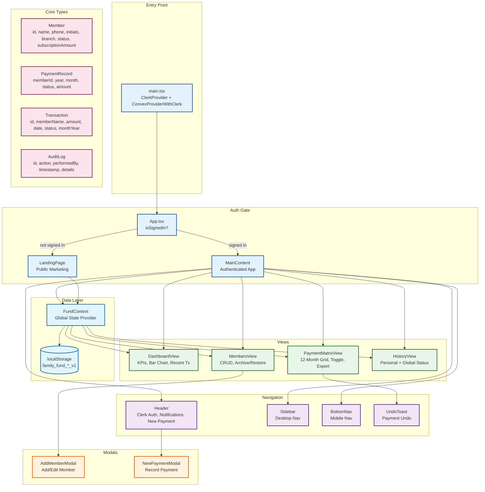
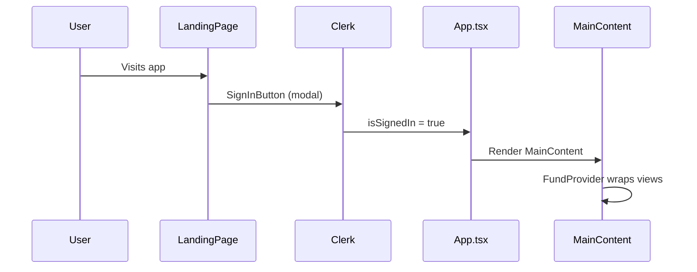
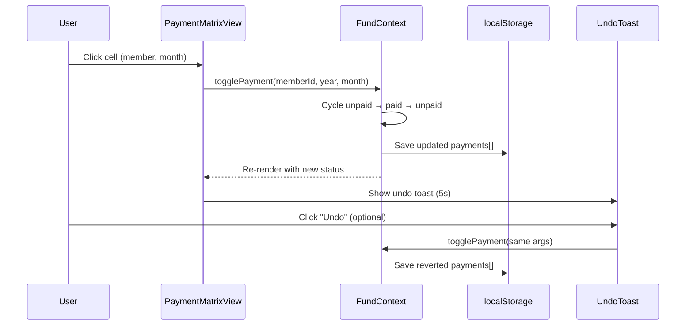
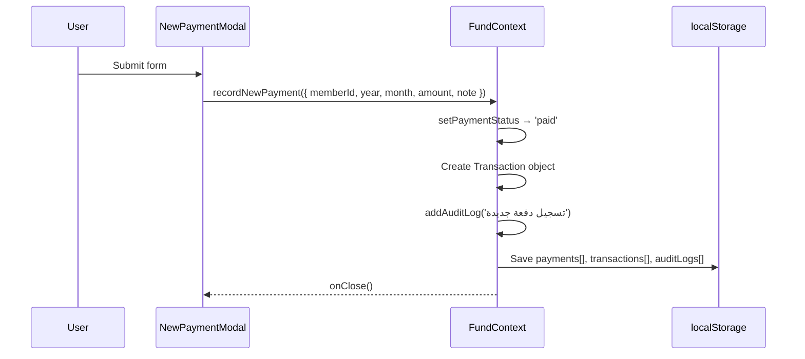

# FamilyFund Architecture

## System Overview



---

## Component Relationships

### Authentication Flow



- `main.tsx` wraps everything in `ClerkProvider` + `ConvexProviderWithClerk`
- `App.tsx` checks `useUser().isSignedIn` — shows `LandingPage` if false, `MainContent` if true
- `Header.tsx` shows `SignInButton` (modal mode) or `UserButton` based on auth state

### State Management (FundContext)

```mermaid
graph LR
    subgraph "FundContext State"
        M[members[]]
        P[payments[]]
        T[transactions[]]
        L[auditLogs[]]
        SY[selectedYear]
        SM[selectedMonth]
        AT2[activeTab]
    end

    subgraph "Actions"
        AM[addMember]
        UM[updateMember]
        TMA[toggleMemberArchive]
        TP[togglePayment]
        RNP[recordNewPayment]
        E[exportToCSV]
        RD[resetData]
    end

    subgraph "Persistence"
        LS[(localStorage)]
    end

    M --> LS
    P --> LS
    T --> LS
    L --> LS

    AM --> M
    AM --> P
    UM --> M
    TMA --> M
    TP --> P
    RNP --> P
    RNP --> T
    E --> M
    E --> P
    RD --> LS
```

**State slices:**
| Slice | Type | Storage Key | Description |
|-------|------|-------------|-------------|
| `members` | `Member[]` | `family_fund_members_v1` | 48 family members with name, phone, branch, subscription |
| `payments` | `PaymentRecord[]` | `family_fund_payments_v1` | Per-member per-month payment status (paid/unpaid/pending) |
| `transactions` | `Transaction[]` | `family_fund_transactions_v1` | Payment transaction log with relative dates |
| `auditLogs` | `AuditLog[]` | `family_fund_logs_v1` | Action audit trail for all mutations |

**Key actions:**
| Action | Effect |
|--------|--------|
| `addMember(data)` | Creates member + 36 payment slots (3 years × 12 months) |
| `updateMember(id, data)` | Partial update on member fields |
| `toggleMemberArchive(id)` | Flips `status` between `active` and `archived` |
| `togglePayment(memberId, year, month)` | Cycles `unpaid` → `paid` → `unpaid` |
| `recordNewPayment(data)` | Sets payment to `paid` + creates Transaction + audit log |
| `exportToCSV()` | Downloads UTF-8 CSV with Arabic BOM |
| `resetData()` | Clears all localStorage keys, reloads seed data |
| `getMemberYearTotal(id, year)` | Sums paid amounts for a member in a year |
| `getYearStats(year)` | Returns `{ expected, collected, remaining, complianceRate }` |

### View Components

| Component | Lines | Purpose | Key Features |
|-----------|-------|---------|--------------|
| `LandingPage.tsx` | 450+ | Public marketing page | GSAP ScrollTrigger, features grid, team section, Clerk CTA |
| `DashboardView.tsx` | 305 | KPIs + charts | 4 KPI cards, 12-month bar chart with year switcher, recent transactions |
| `PaymentMatrixView.tsx` | 306 | Payment grid | Sticky right column, 576 toggle cells, search, filter, CSV export, undo toast |
| `MembersView.tsx` | 205 | Member management | Card grid, search, active/archived/all tabs, archive/restore with confirm |
| `HistoryView.tsx` | 267 | Payment history | Bento layout, personal summary, fund health ring, per-month member status |
| `Header.tsx` | 129 | Top bar | Clerk auth, notifications dropdown, new payment button |
| `Sidebar.tsx` | 69 | Desktop nav | 4 tabs with active member count badge |
| `BottomNav.tsx` | 42 | Mobile nav | 4 tabs, floating bottom bar |
| `UndoToast.tsx` | — | Undo toast | 5-second dismiss, calls `onUndo` callback |

### Modal Components

| Modal | Trigger | Fields |
|-------|---------|--------|
| `AddMemberModal.tsx` | MembersView "Add" / "Edit" button | name, phone, branch (datalist), subscriptionAmount |
| `NewPaymentModal.tsx` | Header / PaymentMatrixView "New Payment" | memberId (select), year, month, amount, note |

Both use native `<dialog>` with `showModal()` / `close()` API.

---

## Data Flow

### Payment Toggle Flow


### New Payment Flow


---

## Persistence Architecture

All data lives in `localStorage` with versioned keys:

| Key | Type | Version |
|-----|------|---------|
| `family_fund_members_v1` | `Member[]` | v1 |
| `family_fund_payments_v1` | `PaymentRecord[]` | v1 |
| `family_fund_transactions_v1` | `Transaction[]` | v1 |
| `family_fund_logs_v1` | `AuditLog[]` | v1 |

**Initialization:** On first load (no localStorage), seed data from `initialMembers.ts` is used:
- 48 members with `subscriptionAmount: 200` JOD
- Payment records for 2024, 2025, 2026 with realistic paid/unpaid/pending distribution
- 5 seed transactions with relative Arabic dates

**Convex backend:** Wired in `main.tsx` via `ConvexProviderWithClerk` but currently dormant — all reads/writes go through `FundContext` → `localStorage`. Ready for activation when multi-device sync is needed.

---

## Styling Architecture

### Tailwind CSS v4 Theme Tokens (`index.css`)
```css
@theme {
  --color-fund-green: #154212;        /* Primary brand */
  --color-fund-green-light: #2d5a27;  /* Hover states */
  --color-fund-surface: #f8f9ff;      /* Background */
  --color-fund-border: #e2e8f0;       /* Borders */
  --color-fund-muted: #5c6357;        /* Secondary text */
  --color-fund-text: #0b1c30;         /* Primary text */
  --color-fund-accent: #eff4ff;       /* Accent background */
  --font-family-arabic: 'IBM Plex Sans Arabic', sans-serif;
}
```

### Component Styling Patterns
- **`surface-elevated`**: Card with subtle shadow + border (used by all views)
- **`payment-toggle`**: Micro-interaction with `scale(0.96)` on active
- **Status colors**: `status-paid` (green), `status-pending` (amber), `status-danger` (red)
- **RTL-aware**: `text-right` default, `dir-ltr` for phone numbers

### Animation Stack
- **GSAP**: Staggered card entrances, bar chart growth, slide-from-right for matrix
- **Framer Motion**: Landing page enter/exit animations
- **CSS transitions**: Button hover/active states, payment toggle micro-interaction
